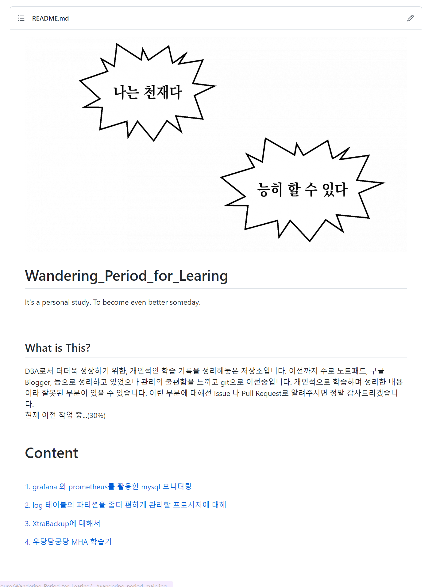
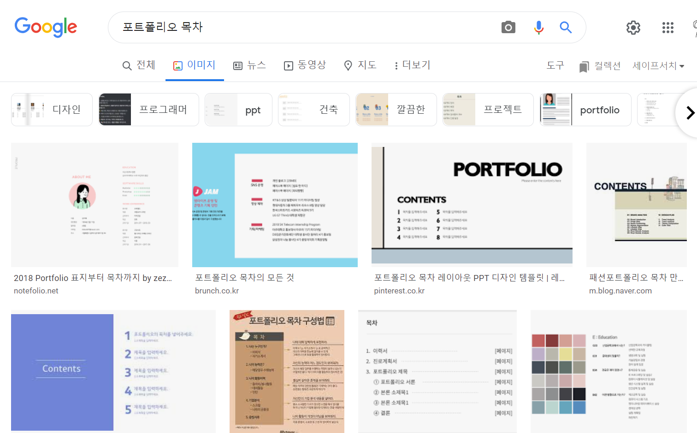
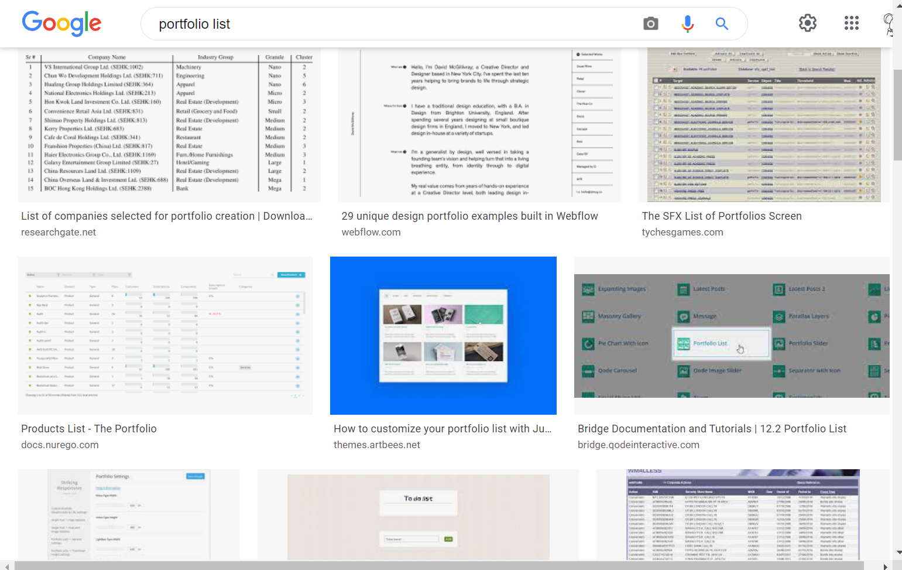
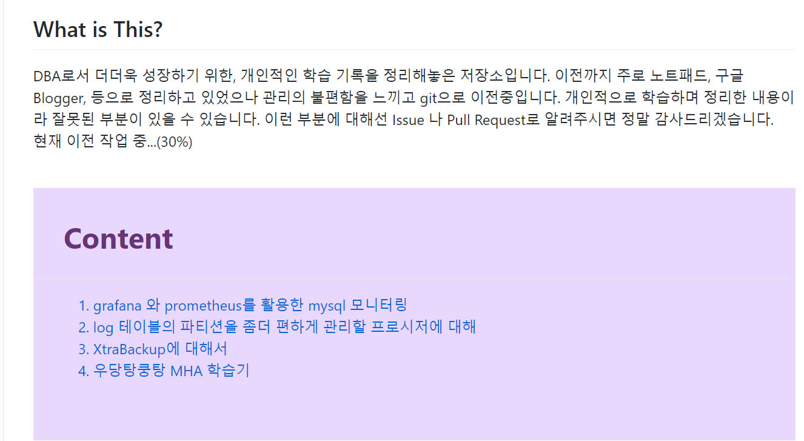

여러분은 어떤 식으로 공부한 내용을 정리하시나요?  
저는 본래 모든 글은 Blogger 또는 메모장에 대충 휘갈기면서 정리하는 편입니다.  
그러다 이번에 이직하려고 포폴용 프로젝트를 준비하려는데, 도움을 주시던 경력 15년 이상 현직 DBA이신 큰외삼촌(이하, 신)께서 조언을 주셨습니다.  

> **세희야.. 그러면 안되고.. git 에 정리해야돼.. 잔디 관리도 하고...**
  **앞으로 계속 포폴용으로 쓸 수 있게... git에 하도록 해봐.. ^^**

아하...  git을 써야하는구나... 대학교 졸업하고 한 번도 들어가보지 않은 github를 꺼내봅시다.  
새로 리포지토리를 생성하고... README 꾸미기를 시작해봅시다.  

  

   

위 이미지는 처음 만든 Git 프로젝트 README 입니다.  

> *저 정도면...? 괜찮을지도...?*

부푼 마음에 검사를 받으러 가자... 

> **좋네. Content 이부분을 포트폴리오 목록 형태를 갖추면 좋겠어**

> ~저한테 왜그러시는거예요~ *아항 네넹 한번 그렇게 변경해볼게용^^*

한번 신님께서 원하시는 대로 변경해봅시다.  
포트폴리오 목록 형태 라는 것이 뭔지 먼저 알아봐야겠습니다.  

  

 <!-- 땀흘리는 농담곰 -->  

> *에...?*

   

  

 <!-- 망가진 농담곰 -->  

구글링을 열심히 해봤지만, 별로 도움이 될만한 정보는 아니었습니다.  
~보통은 다들 ppt로 포트폴리오를 만드니...~  
일단은 그럼... 기존 디자인에 색이라도 넣어볼까요?  

  

아까보단 훨씬 났군요. 다시 검사 받으러 가봅시다.  

> 괜찮네 
 -> 이건 사진 스샷 올리는 것도 좋을듯  
 
OK 콜사인이 떨어졌으니, 이제 그대로 커밋만 해보도록 하죠.  
엥?? 그런데 왜 적용 안대???
왜????  
왜????????????????  

git blog에서는 css 효과가 제대로 적응되지 않습니다..  
따라서 관련하여 따로 스타일 파일을 만들어서 적용을 해야하더라구용...  
~~html, css에게 익숙한 내겐 너무 가혹해..~~  

현재 git blog를 쓰고 있는 것을 보다시피 많은 시행 착오 끝에 현재 디자인으로 만들었습니다.  
현재 사용중인 theme는  입니다.  