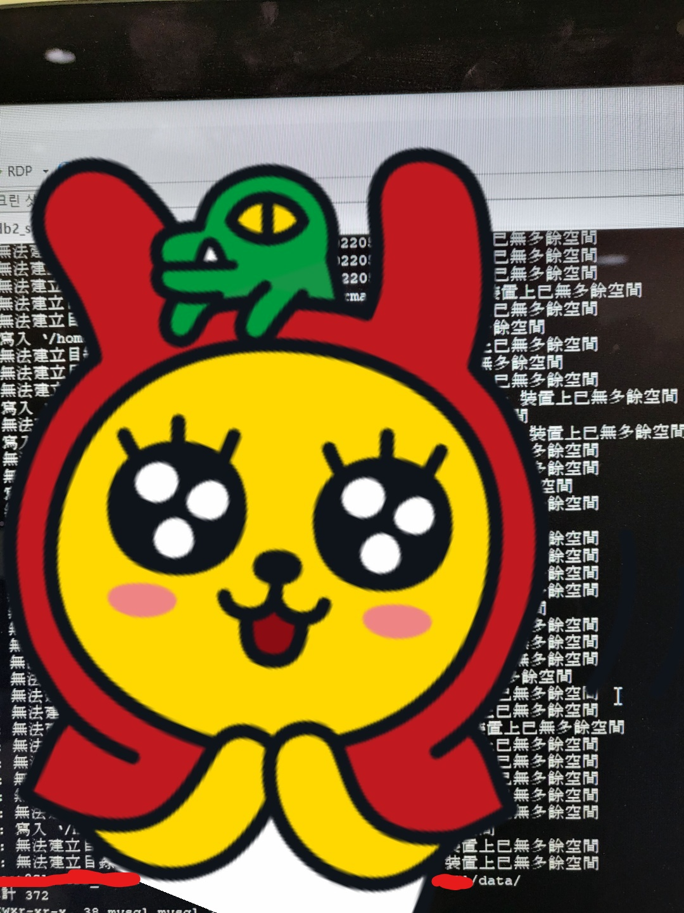
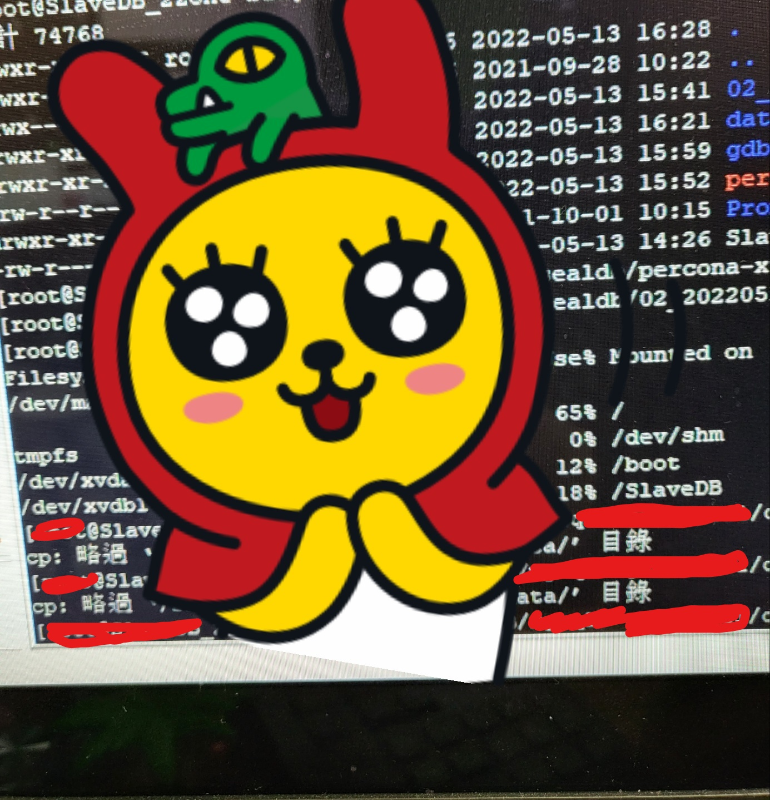

지난주 금요일(2022-05-13)에 있었던 일입니다.  

<br/>
  
특정 지사에서 서버 다운 이슈가 있어서 DB 쪽 이슈일까봐 확인하던 도중, 이상 서버의 Slave 장비가 오작동 중인것을 확인하였습니다.  
저희는 Slave 장비에서 mysqlhotcopy를 사용해서 1시간마다 Backup을 돌리고 있는데요.  
Backup 된 데이터저장소가 전부 비어 있고 그마저도 2시간마다 하나씩 생성되어 있었습니다.  
  
<br/>

원인 파악을 위해 세션을 먼저 확인했습니다.  
백업 작업 전 Read Lock 을 거는 쿼리 세션이 Waiting 상태로 11개가 물려있었습니다.  
가장 처음의 세션이 당시 22시간 전 세션으로 점검 시간이랑 맞물려 있었습니다.  
이쯤에서... 서버 다운 이슈랑 상관없이...  

> BackUp 시스템 관련해서 문제가 있구나...  
그러게.. 진작에 Xtrabackup으로 바꾸자니까.. ㅠㅠ  

~~운영툴 시스템 때문에 쉽게 못바꿈ㅋㅋ 운영툴 다시 만들어야돼~~  

일단 사태는 벌어졌고 원인 파악 및 수습은 별개로 해야하니, Slave DB error 로그를 봅시다.  

**MySQL error 1236, master의 postion을 못찾겠어용~~**  


> 엥???  

이 error가 Backup 시스템이랑 관련이 있진 않을텐데...???  
일단 Backup 시스템은 뒤로 미루고 Slave 장비의 상태 체크를 해보았습니다.  
아니나 다를까, 레플리케이션이 깨져있었습니다... 

~~별도 설정없이 1236 Error 발생하고 레플리케이션이 안깨지면 그게 더 용하지만요...~~  

일은 이미 벌어졌고 뒷 수습을 해야죠.  
일단 급한 마음에 Master의 포지션을 SHOW MASTER STATUS 명령어를 이용해, 알아봅니다.  
저희 Master는 당시에 28번째 bin 로그를 바라보고 있었습니다...  
Slave는.. 2번째 bin 로그를 보고 있었는데 말이죠...  

<br/>  

일단 허둥지둥 Master의 포지션으로 Slave를 맞춰줬습니다.  

>그렇지만... 이게 옳은걸까? 이미 하루 이상 데이터가 깨져있었는데...?  
어차피.. 임검 각인데...(서버 다운 이슈로 인해서 임검이 필요한 상황이었음)  
걍... 임검하는 김에 Master를 풀백업 떠서 Slave로 옮기자!!!  
~~Live 서버에서 Xtrabackup을 사용해볼 기회가 이렇게 찾아올 줄은 몰랐는데요...~~  

  

일단 급하게 개발 서버에 설치되어있는 Xtrabackup을 그대로 지사 라이브 서버 장비에 옮겼습니다.  
그리고 Master 장비에서 익숙하게 게임 DB 저장소를 풀백업 떠줍니다.  

```shell
shell> xtrabackup --defaults-file=/etc/my.conf --user=유저 --host=localhost --port=포트번호 --password=패스워드 --socket=mysql저장위치/tmp/mysqld.sock --backup --target-dir=백업저장위치
```

그 후에 현지 SE분께 말씀드려서 백업 뜬 저장 파일을 Slave 장비로 옮깁니다.  
Xtrabackup은 Restore 시에 Data 폴더가 비워져 있어야하는데요. 
일단 오래된 Data 폴더를 그대로 copy떠서 data_old 로 보관해두고 Restore 하려고 했었는데... 
이럴수가... copy가 안되기 시작합니다. 

>대체 왜????  

원인 조차 파악할 수 없었습니다.  
왜냐구요...?  

  
  

  

정신이 나가버리는 줄 알았습니다..  
copy는 안되고 내용물을 그렇다고 지워버릴수도 없고  
혼자 고군분투 하다가 시간이 오래걸리더라도 일단 tar로 압축하자 싶어서 압축 후 원본 폴더를 지워버렸습니다.  
새로이 Data 폴더를 생성해주고 Restore 해주기로 합니다.  

```shell
shell> xtrabackup --copy-back --target-dir=/usr/local/mysql55/tmep_backup
```

그리고... 안됩니다.  
왜...??? 개발서버에서는 잘 됐는데??  

```shell
Error: datadir must be specified.
```

Datadir 관련해서 에러가 떴었는데요.  
개발 서버에서는 문제가 없었지만(당연, 같은 곳에서 백업하고 복원시켰음)  
이번에는 Master 장비에서 백업을 하고 Slave 장비에서 복원을 하는데 두 장비의 my.conf 설정이 서로 다르기 때문에 일어난 문제였습니다.  
data 폴더에 복원 시켜야하는데 해당 폴더의 위치를 못찾는거죠.  
[관련 참고글](https://bstar36.tistory.com/342)  

```shell
shell> xtrabackup --datadir=Slave 내의 data폴더 위치 --copy-back --target-dir=백업저장위치
```

이제 무사히 복원이 되는 것을 확인하고 tar 로 압축한 old 데이터의 압축을 풉니다.  
그리고 다시... copy를 해서 문제없는 데이터 저장소들을 살려야했는데요...  
여전히 copy 명령어가 되지 않았습니다.  


한참을 고민한 끝에 조금 느리더라도 **winscp**를 사용해서 옮기자는 생각에 옮기기를 했는데요.  
고민한 시간이 무색할 정도로 빠르게 되더라구요 ㅠㅠㅠ  
진짜 cp 앞에 \도 붙여보고 -a도 해보고 -f도 해봤는데 다 안됐었는데...  
~~이럴줄 알았으면 진작에 winscp로 할걸~~   

이렇게 3시간 30분동안의 기나긴 임검 작업을 완료하게 되었습니다.  
~~copy 에러 확인하는데에서 2시간은 쓴거 같아요 ㅠㅠ ~~  

이렇게 수습했음에도 무서운 사실... 2가지...  
- 아직도 왜 slave가 포지션을 잃어버렸는지 알지 못함.  
- 포지션 잃어버린 거랑 무슨 연관이 있는진 모르겠는데 왜 DB 백업이 제대로 안된건지도 모름  
    -> 의심 가는 건 2가지 정도 있습니다.  
    Slave DB 장비가 아직 bin log 파일을 읽고 있는 와중에 DB 점검 작업을 SE에서 시작을 해서 Master의 log 파일들이 전부 백업되며 리셋되는 것과  
    Slave DB 장비가 아직 bin log 파일을 읽고 있는 와중에 DB 백업 작업이 들어와서 락 경합이 일어나는 것  
    둘 다 제가 DB 관리 하면서 처음 보는 사태라서 *대체.. 우리 DB에 무슨일이...* 상태네요 ㅠㅠ  

~~사실 서버 다운 이슈 까지 합치면 무서운 사실이 3가지가 됨... 우리는 왜 서버가 다운됐는지도 모른...다...~~  

갑작스런 이슈 덕분에 라이브 서버에서 Xtrabackup을 사용해보게 됐는데요.  
개인적인 경험을 쌓을 수 있어서 그나마 다행인거 같네요.  