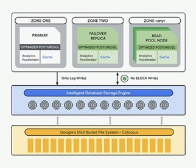
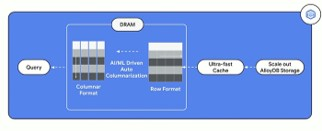

최근 필요하여 R&D 한 내용을 정리.  
  
업무에 필요하여 AlloyDB 관련 내용 조사하였음.  
  
   
  
  

## AlloyDB
- 2022년 5월 Google I/O 2022에서 첫 발표  

- PostgreSQL 기반 RDBMS  

- **컴퓨팅과 스토리지의 완전한 분리**  
  
	+ 데이터베이스 인스턴스와는 별도로 확장되며 프라이머리 인스턴스로부터 작업을 오프로드 하는 새로운 지능형 데이터베이스 최적화 스토리지  

- DRAM, 초고속 캐시 및 스토리지 간의 자동 데이터 티어링 가능  
  
  
  
- 쿼리 성능 극대화를 위해 행 기반과 열 기반 형식 모두 사용  
	+ 쿼리 플래너는 모든 쿼리의 성능을 최적화 하기 위해 행 기반, 열 기반, 또는 하이브리드 실행 중 하나를 선택

### 장점
- 빠른 트랜잭션 처리 속도  
	+ 표준 PostgreSQL 대비 4배 이상 빠른 트랜잭션 워크로드 속도  
	+ Aurora 보다 트랜잭션 데이터 처리에서 2배 빠른 수준  
  
- 실시간 비즈니스 인사이트
	+ 분석 쿼리에 대해 표준 PostgreSQL 대비 최대 100배 빠른 속도
	+ 비즈니스 인텔리전스, 보고, 하이브리드 트랜잭션 및 분석 워크로드(HTAP)를 실행할 때, 운영 성능에 영향 X
	+ Vertex AI와 통합딘 Goolge AI 플랫폼을 동해 쿼리 또는 트랜잭션 내에서 직접 머신러닝 모델 호출 가능
	+ 지연 시간이 짧고 처리량이 높은 강화된 통계 산출

- 높은 신뢰성과 가용성
	+ 유지보수를 포함한 99.99% 업타임 SLA 제공
	+ 데이터베이스의 크기 및 로드와 관계 없이, 대부분의 장애를 자동으로 감지하고 60초 이내에 복구
	+ 무중단 인스턴스 크기 조정 및 데이터베이스 유지보수 지원

- 예측 가능한 투명한 가격 책정
  
  
  

### 단점
- **2022년 5월 발표된 기술**로 관련된 레퍼런스가 적음  
	+ Stackoverflow 기준, 11건  
	+ Google 검색 시, Google Cloud 자체 도큐먼트를 제외, 국내 자료 2건(뉴스 기사도 제외함)  
	+ 국내에(Yes24 기준) 관련 서적 없음  
  
- **GCP의 BigQuery와 자동 동기화 불가능**

- 현재 서울 리전 사용 불가 
	+ 지원되는 아시아 리전 지역: 뭄바이, 싱가폴, 도쿄
