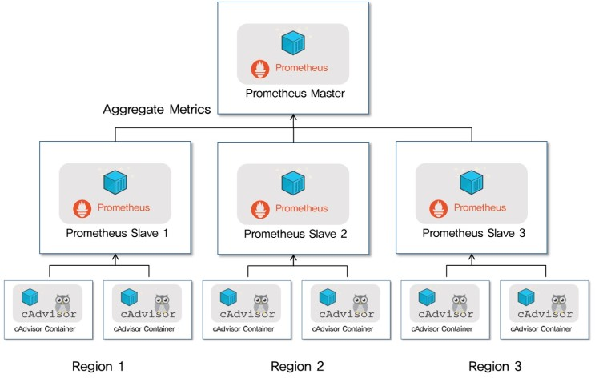
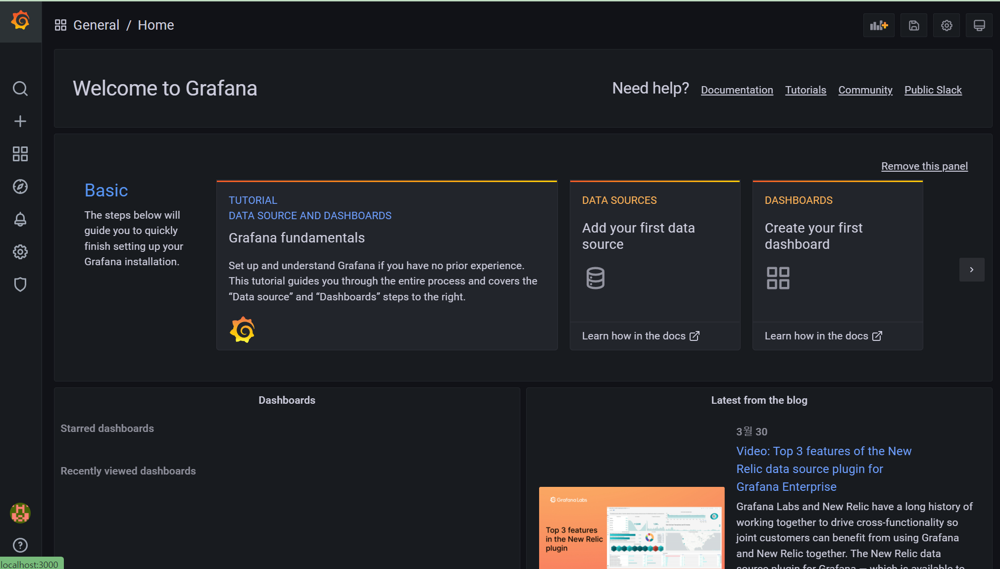
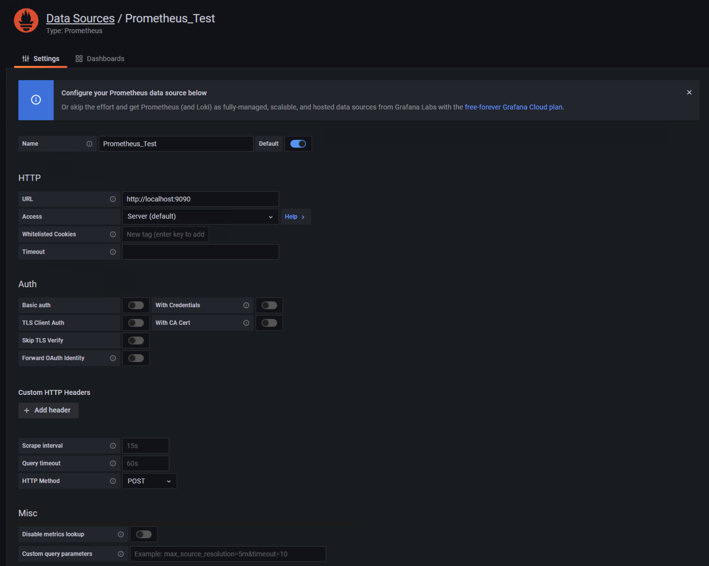
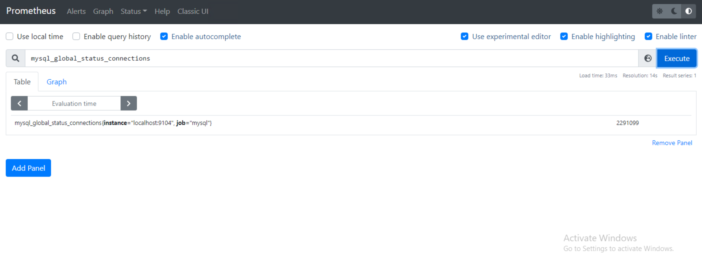

# Grafana와 Prometheus를 활용한 MySQL 모니터링
 - [Purpose of Study](#purpose-of-study)
 - [What is this?](#what-is-this)
    + Grafana란?
    + Prometheus란?
 - [Why Choose this?](#why-choose-this)
 - [Let's Get Started](#lets-get-started)
    + Grafana 설치하기
    + Prometheus 설치하기
    + 각 DB 장비에 환경 세팅하기
    + 이제 실행해봅시다.
 - [Completion](#전부-적용이-된-모습)

</br>


# Purpose of Study
Grafana와 Prometheus를 활용하여 다수의 MySQL 장비를 모니터링 하는 방법을 알아보고자 하였습니다.

</br>


# What is this? 
 
### Grafana란? 
 - [Grafana 공식 웹사이트](https://grafana.com/)
 - [Grafana 공식 GitHub 저장소](https://github.com/grafana/grafana)

다중 플랫폼 오픈소스 분석 및 대화형 시각화 웹 애플리케이션으로 시계열 데이터에 대한 대시보드를 제공합니다.다양한 DB를 연결하여 데이터를 가져와 시각화 가능하며 시각화한 그래프에서 특정 수치 이상으로 값이 치솟을 때, 알림 기능 제공합니다. 
</br></br>
</br></br>


### Prometheus란?
 - [Prometheus 공식 웹사이트](https://prometheus.io/)

메트릭 수집, 시각화, 알림, 서비스 디스커버리 기능을 제공하는 오픈 소스 모니터링 시스템입니다. 
</br>
대표적인 기능은 아래와 같습니다. 
 + Pulling 방식의 메트릭 수집, 시계열 데이터 저장
 + PromQL을 활용하여 저장된 시계열을 쿼리 및 집계
 + 서비스 디스커버리
 + 데이터 시각화

대상 시스템으로부터 각종 모니터링 지표를 수집하여 저장하고 검색할 수 있는 시스템으로 구조가 간단하여 운영이 쉽고 Grafana를 통한 시각화를 지원합니다. 

</br>


# Why Choose This? 
Prometheus의 장점과 단점은 다음과 같습니다. 
### 장점
 - Pull 방식의 구조를 채택하여 모든 메트릭에 대한 데이터를 중앙 서버로 보내지 않아도 됨  
 push 방식의 구조일 경우, 부하가 높은 상황일 때, 메트릭 수집을 하기 위한 전송 부분이 어플리케이션에 부하가 될 수 있으며 문제를 유발할 수 있는 fail point가 됨. 
 - Grafana와의 연동을 통한 운영이 쉬움.
 - Linux, Window 등의 OS metric 뿐 아니라 각종 Third-party의 다양한 exporter 제공

### 단점
 - 클러스터링이 불가능하다. 여러 장비를 모니터링 하려면 아래 그림처럼 계층 구조로 구성해야 함.
 - 일정 주기로 메트릭을 가져오기 때문에 Pulling 하는 순간의 스냅샷 정보만 알 수 있음. 스냅샷의 연속된 모음이기 때문에 근사값의 형태임. 
 - 프로메테우스 서버가 다운되거나, 설정 변경, 등을 위하여 재시작 할 경우, 그간의 메트릭은 유실됨.
  
</br>

  

단점이 눈에 띄지 않는 것은 아니었지만, 무엇보다 Pulling 방식의 메트릭 수집과 운영이 쉽다는 장점이 선택에 지대한 영향을 끼치게 되었습니다. 최종적으로 적용하고자 하는 DB 장비는 이미 라이브 서비스 중인 DB 장비이기 때문에 최대한 라이브 서비스에 지장이 되지 않도록 하고자 하였습니다. 

</br>


#### 테스트 환경 정보
>OS: CentOS 6, Window 10</br>
MySQL: MySQL 5.6</br>
Grafana: 8.0.3</br>
Prometheus: 2.29.2</br>
mysqld_exporter: 0.13.0</br>

</br>

# Let's Get Started  

Grafana와 Prometheus를 사용하여 다수의 MySQL 장비의 모니터링 할 때, 아키텍처는 아래와 같습니다. 


각 Region에 Prometheus를 배치한 뒤, 이를 Master에 Aggreagate하는 방식이 Prometheus가 공식적으로 권장하는 다중화 방식입니다. 적용 테스트가 목적이므로 Master 역할을 하는 Prometheus를 작업하는 컴퓨터에 설치하고 개발 서버의 DB 장비에 Slave 역할의 Prometheus를 설치하였습니다. 

</br>

### Grafana 설치하기
- [Grafana 설치 링크](https://grafana.com/grafana/download?pg=get&plcmt=selfmanaged-box1-cta1)  

위 링크에서 사용하는 OS 버전에 맞는 파일을 다운로드 받습니다.  
저의 경우는 Master 역할을 하는 Prometheus와 모니터링을 할 Grafana를 같은 서버에 둘 예정이므로 작업하는 컴퓨터의 OS 인 Windows 버전으로 다운로드 받았습니다.  

Grafana를 다운로드 받았다면 [bin](/grafana-8.0.3/bin/) 안에 있는 grafana 서버 실행 파일을 실행 시켜줍니다.  
브라우저 창을 띄우고 주소창에 [localhost:3000](http://localhost:3000/) 을 입력해봅시다. 
아래와 같은 화면이 뜹니다.  


초기 아이디와 비밀번호는 admin 입니다. 입력하여 로그인 하면 새로운 비밀번호를 입력하는 창이 뜹니다. 앞으로 사용할 비밀번호를 입력해주도록 합시다.  

처음 로그인 하면 다음 화면이 뜹니다.  

  

왼쪽 메뉴 바에 있는 톱니바퀴 모양의 설정 버튼을 눌러 줍니다. 검색 창에 Prometheus를 찾아서 추가해줍니다. 
아직 Prometheus를 설치하지 않았기 때문에 아래 이미지와 같이 설정한 뒤, 종료합니다.  

</br>



</br>  

### Prometheus 설치하기
 - [Prometheus 설치 링크](https://prometheus.io/download/)  
 - [prometheus.yml Configuration Docs](https://prometheus.io/docs/prometheus/latest/configuration/configuration/)
 - [Prometheus Federation 설명](https://prometheus.io/docs/prometheus/latest/federation/)

Prometheus는 prometheus.yml 파일을 사용하여 기본적인 설정을 할 수 있습니다. 

```prometheus.yml
# 기본적인 전역 설정
global:
  scrape_interval:     15s # 매트릭 수집 주기
  evaluation_interval: 15s # 매트릭 수집 주기
  # scrape_timeout 은 기본적으로 10초로 세팅되어 있음

# Alertmanager 설정
alerting:
  alertmanagers:
  - static_configs:
    - targets:
      # - alertmanager:9093

# 규칙을 처음 한번 로딩하고 'evaluation_interval' 설정에 따라 정기적으로 규칙 평가
rule_files:
  # - "first_rules.yml"
  # - "second_rules.yml"

# A scrape configuration containing exactly one endpoint to scrape:
# Here it's Prometheus itself.
scrape_configs:
  # The job name is added as a label `job=<job_name>` to any timeseries scraped from this config.
  - job_name: 'prometheus'

    # metrics_path defaults to '/metrics'
    # scheme defaults to 'http'.

    static_configs:
    - targets: ['localhost:9090']
```
</br>

저는 아래와 같이 설정했습니다. 
대부분의 설정을 따로 건드리지 않고 scrape_configs 부분만 수정하였습니다. 

</br>

```prometheus.yml ver.dev
# my global config
global:
  scrape_interval:     15s # Set the scrape interval to every 15 seconds. Default is every 1 minute.
  evaluation_interval: 15s # Evaluate rules every 15 seconds. The default is every 1 minute.
  # scrape_timeout is set to the global default (10s).

# Alertmanager configuration
alerting:
  alertmanagers:
  - static_configs:
    - targets:
      # - alertmanager:9093

# Load rules once and periodically evaluate them according to the global 'evaluation_interval'.
rule_files:
  # - "first_rules.yml"
  # - "second_rules.yml"

# A scrape configuration containing exactly one endpoint to scrape:
# Here it's Prometheus itself.
scrape_configs:
  # The job name is added as a label `job=<job_name>` to any timeseries scraped from this config.
  - job_name: 'prometheus'

    # metrics_path defaults to '/metrics'
    # scheme defaults to 'http'.
    static_configs:
    - targets: ['localhost:9090']

  # metrics_path를 federate 방식으로 합니다. 
  - job_name: 'federate'
    scrape_interval: 60s

    # honor_labels는 Prometheus가 라벨 간의 충돌을 처리하는 방법을 제어합니다. 
    # true일 경우, 라벨 경합은 라벨을 유지함으로써 해결됩니다. 
    honor_labels: true
    metrics_path: '/federate'

    # Optional HTTP URL parameters.
    params:
     'match[]':
       - '{__name__=~".+"}'

    static_configs:
    - targets: ['Slave IP:9090']
      labels:
       clusterID: cluster1
```

</br>

여러 대의 Slave Prometheus를 바라보기 위해 Master에서 federate 방식으로 설정해줍니다. 
이후, 바라보는 Slave 추가 시에는 아래와 같이 추가해줍니다. 

</br>

```prometheus.yml Slave 추가 시
    static_configs:
    - targets: ['Slave IP1:9090']
      labels:
       clusterID: cluster1
    - targets: ['Slave IP2:9090']
      labels:
       clusterID: cluster2
```

</br>

### 각 DB 장비에 환경 세팅하기 
먼저 mysql 에 user 생성을 해줍시다.   

```
CREATE USER 'exporter'@'localhost' IDENTIFIED BY 'USER_PASSWORD';
GRANT ALL PRIVILEGES ON *.* TO 'exporter'@'localhost';
```

CentOS 장비에 mysqld_exporter, prometheus를 설치해줍니다. 
각각 설치 방법은 생략하도록 하겠습니다. 
설치 후, 시스템 등록은 아래 파일을 참조해주세요. 
- [prometheus](./files/prometheus.txt)
- [mysqld_exporter](./files/mysqld_exporter.txt)
- [mysqld_exporter의 시스템 변수](./files/sysconfig_mysqld_exporter.txt)
- [node_exporter](./files/node_exporter.txt)

node_exporter 의 경우는 이번 글에서 사용하지 않았으나 함께 첨부합니다.   

다음은 mysqld_exporter의 설정입니다. 

``` mysqld_exporter.cnf
[client]
user=exporter
password=USER_PASSWORD
secure_auth=0

[mysqld]
old_passwords=1
allowOldPasswords=1
```

위에서 만든 유저와 비밀번호를 입력합니다.   
테스트용 장비의 DB의 경우, 사용 버전이 낮아, old_password에 대한 설정이 필요했습니다.   

다음은 Prometheus의 설정입니다. 
```
# my global config
global:
  scrape_interval:     15s # Set the scrape interval to every 15 seconds. Default is every 1 minute.
  evaluation_interval: 15s # Evaluate rules every 15 seconds. The default is every 1 minute.
  # scrape_timeout is set to the global default (10s).

# Alertmanager configuration
alerting:
  alertmanagers:
  - static_configs:
    - targets:
      # - alertmanager:9093

# Load rules once and periodically evaluate them according to the global 'evaluation_interval'.
rule_files:
  # - "first_rules.yml"
  # - "second_rules.yml"

# A scrape configuration containing exactly one endpoint to scrape:
# Here it's Prometheus itself.
scrape_configs:
  # The job name is added as a label `job=<job_name>` to any timeseries scraped from this config.
  - job_name: 'prometheus'

    # metrics_path defaults to '/metrics'
    # scheme defaults to 'http'.

    static_configs:
    - targets: ['localhost:9090']
    
  - job_name: "mysql"
    static_configs:
      - targets: ["localhost:9104"]
```

해당 Prometheus는 local의 mysql server만을 바라보기 때문에 이렇게 구성하였습니다. 

</br>   

### 이제 실행해봅시다. 
test 장비의 mysqld_exporter와 prometheus를 차례로 실행해줍니다.   
실행 후, http://Slave IP:9090 을 브라우저 주소창에 입력하면 아래와 같은 화면이 뜹니다. 

   

local의 mysqld_exporter를 잘 바라보는지 확인해봅시다. 검색 창에 mysql_global_status_connections를 입력합니다. 

   

위와 같은 결과가 나오면 잘 연결된 것입니다. 

</br>

이제는 master 장비의 prometheus와 Grafana를 실행합니다. 그리고 Grafana의 대시보드를 만들어줍니다. 
대시보드는 [Grafana Labs 대시보드](https://grafana.com/grafana/dashboards/)에서 적당한 것을 가져왔습니다.
 - [Mysql - Prometheus](https://grafana.com/grafana/dashboards/6239)

헤당 json 파일을 방금 만든 대시보드에 import 해줍니다.   

</br>
</br>


# 전부 적용이 된 모습 
